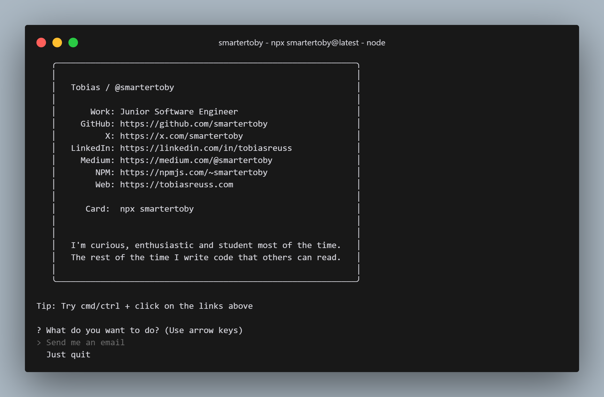

# Hi 👋! My name is Tobias

> I'm curious, enthusiastic and student most of the time. The rest of the time I write code that others can read.

## Connect With Me

  <a href="https://linkedin.com/in/tobiasreuss" target="_blank">
    
  </a>
  <a href="https://x.com/smartertoby" target="_blank">
    
  </a>
  <a href="mailto:contact@tobiasreuss.com" target="_blank">
    
  <a href="https://discordapp.com/users/724712767080235049" target="_blank">
    
  </a>
  <a href="https://medium.com/@tobiasreuss" target="_blank">
    
  </a>
  <a href="https://dev.to/smartertoby" target="_blank">
    
  </a>

## Tech Stack

<div align="left">
  
  
  
  
  
  
  
  
  
  
  
  
  
  
  
  
  
  
  
  
  
  
  
  
  
  
  
  
  
  
  
  
  
</div>

<br/>
<hr/>

**A little more about me... with npm installed, just type ...**

```
npx smartertoby
```
<div align="center">
  
</div>


<hr/>

<!--START_SECTION:waka-->


**I'm a Night 🦉** 

```text
🌞 Morning                55 commits          ⣿⣀⣀⣀⣀⣀⣀⣀⣀⣀⣀⣀⣀⣀⣀⣀⣀⣀⣀⣀⣀⣀⣀⣀⣀   03.32 % 
🌆 Daytime                515 commits         ⣿⣿⣿⣿⣿⣿⣿⣿⣀⣀⣀⣀⣀⣀⣀⣀⣀⣀⣀⣀⣀⣀⣀⣀⣀   31.08 % 
🌃 Evening                1087 commits        ⣿⣿⣿⣿⣿⣿⣿⣿⣿⣿⣿⣿⣿⣿⣿⣿⣀⣀⣀⣀⣀⣀⣀⣀⣀   65.60 % 
🌙 Night                  0 commits           ⣀⣀⣀⣀⣀⣀⣀⣀⣀⣀⣀⣀⣀⣀⣀⣀⣀⣀⣀⣀⣀⣀⣀⣀⣀   00.00 % 
```
📅 **I'm Most Productive on Tuesday** 

```text
Monday                   121 commits         ⣿⣿⣀⣀⣀⣀⣀⣀⣀⣀⣀⣀⣀⣀⣀⣀⣀⣀⣀⣀⣀⣀⣀⣀⣀   07.30 % 
Tuesday                  1049 commits        ⣿⣿⣿⣿⣿⣿⣿⣿⣿⣿⣿⣿⣿⣿⣿⣿⣀⣀⣀⣀⣀⣀⣀⣀⣀   63.31 % 
Wednesday                63 commits          ⣿⣀⣀⣀⣀⣀⣀⣀⣀⣀⣀⣀⣀⣀⣀⣀⣀⣀⣀⣀⣀⣀⣀⣀⣀   03.80 % 
Thursday                 8 commits           ⣀⣀⣀⣀⣀⣀⣀⣀⣀⣀⣀⣀⣀⣀⣀⣀⣀⣀⣀⣀⣀⣀⣀⣀⣀   00.48 % 
Friday                   63 commits          ⣿⣀⣀⣀⣀⣀⣀⣀⣀⣀⣀⣀⣀⣀⣀⣀⣀⣀⣀⣀⣀⣀⣀⣀⣀   03.80 % 
Saturday                 150 commits         ⣿⣿⣀⣀⣀⣀⣀⣀⣀⣀⣀⣀⣀⣀⣀⣀⣀⣀⣀⣀⣀⣀⣀⣀⣀   09.05 % 
Sunday                   203 commits         ⣿⣿⣿⣀⣀⣀⣀⣀⣀⣀⣀⣀⣀⣀⣀⣀⣀⣀⣀⣀⣀⣀⣀⣀⣀   12.25 % 
```


📊 **This Week I Spent My Time On** 

```text
🕑︎ Time Zone: Europe/Berlin

💬 Programming Languages: 
TypeScript               2 hrs 13 mins       ⣿⣿⣿⣿⣿⣿⣿⣿⣿⣀⣀⣀⣀⣀⣀⣀⣀⣀⣀⣀⣀⣀⣀⣀⣀   34.81 % 
JSON                     1 hr 33 mins        ⣿⣿⣿⣿⣿⣿⣀⣀⣀⣀⣀⣀⣀⣀⣀⣀⣀⣀⣀⣀⣀⣀⣀⣀⣀   24.47 % 
CSS                      48 mins             ⣿⣿⣿⣀⣀⣀⣀⣀⣀⣀⣀⣀⣀⣀⣀⣀⣀⣀⣀⣀⣀⣀⣀⣀⣀   12.73 % 
Markdown                 46 mins             ⣿⣿⣿⣀⣀⣀⣀⣀⣀⣀⣀⣀⣀⣀⣀⣀⣀⣀⣀⣀⣀⣀⣀⣀⣀   12.17 % 
JavaScript               29 mins             ⣿⣿⣀⣀⣀⣀⣀⣀⣀⣀⣀⣀⣀⣀⣀⣀⣀⣀⣀⣀⣀⣀⣀⣀⣀   07.67 % 

🔥 Editors: 
WebStorm                 6 hrs 22 mins       ⣿⣿⣿⣿⣿⣿⣿⣿⣿⣿⣿⣿⣿⣿⣿⣿⣿⣿⣿⣿⣿⣿⣿⣿⣿   99.66 % 
IntelliJ                 1 min               ⣀⣀⣀⣀⣀⣀⣀⣀⣀⣀⣀⣀⣀⣀⣀⣀⣀⣀⣀⣀⣀⣀⣀⣀⣀   00.34 % 

💻 Operating System: 
Windows                  6 hrs 23 mins       ⣿⣿⣿⣿⣿⣿⣿⣿⣿⣿⣿⣿⣿⣿⣿⣿⣿⣿⣿⣿⣿⣿⣿⣿⣿   100.00 % 
```


<!--END_SECTION:waka-->

<br/>


<br/>


